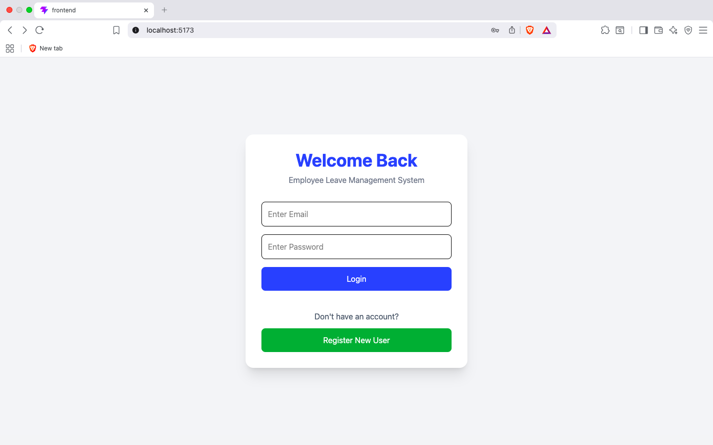
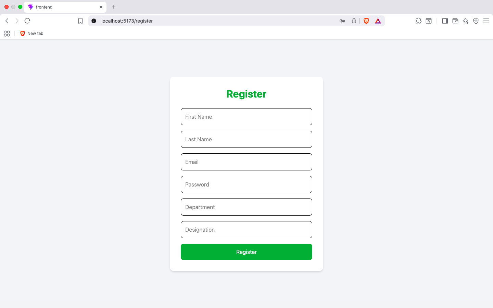
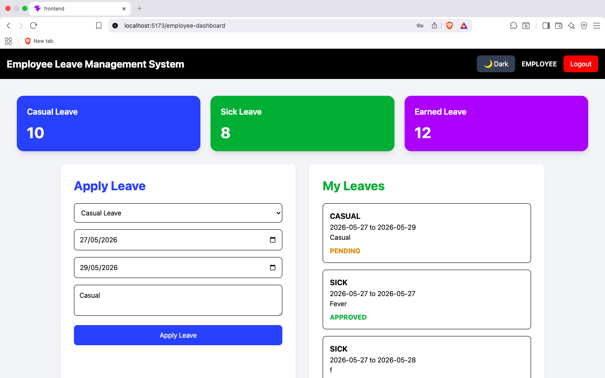
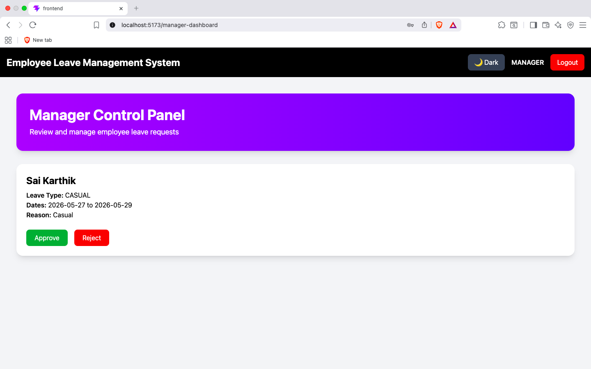
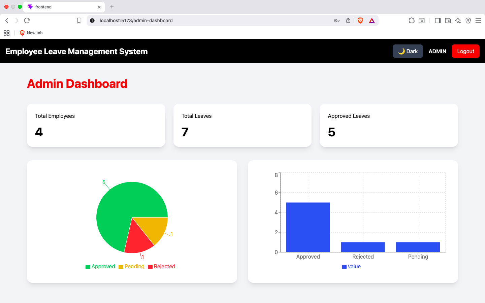

# Employee Leave Management System


---

# Employee Leave Management System

A Full Stack Enterprise Web Application developed using Spring Boot, React.js, MySQL, JWT Authentication, and Tailwind CSS.

The application helps organizations manage employee leave requests, approvals, leave analytics, and role-based workflows through secure authentication and modern dashboards.

---

# Features

## Authentication & Security

- JWT Authentication
- Spring Security Integration
- BCrypt Password Encryption
- Role-Based Authorization
- Protected Routes
- Secure Login & Registration

---

## Employee Features

- Apply Leave
- View Leave History
- Leave Status Tracking
- Responsive Dashboard
- Dark Mode Support

---

## Manager Features

- View Pending Leave Requests
- Approve Leave Requests
- Reject Leave Requests
- Add Review Comments

---

## Admin Features

- Dashboard Analytics
- Employee Monitoring
- Leave Statistics
- Charts & Graphs
- System Overview Dashboard

---

# Tech Stack

## Backend

- Java
- Spring Boot
- Spring Security
- JWT Authentication
- Spring Data JPA
- Hibernate
- MySQL
- Maven

---

## Frontend

- React.js
- React Router DOM
- Axios
- Tailwind CSS
- Recharts
- Vite

---

# Application Screenshots

> Create a folder named:

```bash
screenshots
```

inside your project root.

Add screenshots using these exact names:

```bash
screenshots/
│
├── login-page.png
├── register-page.png
├── employee-dashboard.png
├── apply-leave.png
├── manager-dashboard.png
├── leave-approval.png
├── admin-dashboard.png
├── analytics-dashboard.png
├── dark-mode.png
```

---

# Login Page



---

# Register Page



---

# Employee Dashboard



---

# Apply Leave


---

# Manager Dashboard



---

# Leave Approval Workflow


---

# Admin Dashboard



---

# Analytics Dashboard


---

# Dark Mode UI


---

# System Architecture

```text
Frontend (React.js)
        ↓
REST APIs
        ↓
Backend (Spring Boot)
        ↓
MySQL Database
```

---

# Database Design

## Employee Table

Stores:

- Employee Information
- Roles
- Leave Balances
- Authentication Data

---

## Leave Table

Stores:

- Leave Requests
- Leave Status
- Leave Dates
- Manager Comments

---

# Project Structure

```bash
employee-leave-management-system/
│
├── backend/
│   ├── src/main/java/com/elms/backend
│   │   ├── config
│   │   ├── controller
│   │   ├── dto
│   │   ├── entity
│   │   ├── enums
│   │   ├── repository
│   │   ├── security
│   │   ├── service
│   │   └── util
│   │
│   └── src/main/resources
│
├── frontend/
│   ├── src
│   │   ├── api
│   │   ├── components
│   │   ├── pages
│   │   └── routes
│
└── screenshots/
```

---

# API Endpoints

## Authentication APIs

| Method | Endpoint | Description |
|------|------|------|
| POST | /api/employees/register | Register Employee |
| POST | /api/employees/login | Login User |

---

## Employee APIs

| Method | Endpoint | Description |
|------|------|------|
| POST | /api/employees/apply-leave | Apply Leave |
| GET | /api/employees/my-leaves | Get Employee Leaves |

---

## Manager APIs

| Method | Endpoint | Description |
|------|------|------|
| GET | /api/employees/pending-leaves | Get Pending Leaves |
| PUT | /api/employees/update-leave-status/{id} | Approve/Reject Leave |

---

## Admin APIs

| Method | Endpoint | Description |
|------|------|------|
| GET | /api/employees/dashboard | Dashboard Analytics |

---

# Backend Setup

## Clone Repository

```bash
git clone https://github.com/yourusername/employee-leave-management-system.git
```

---

## Navigate to Backend Folder

```bash
cd backend
```

---

## Configure MySQL Database

Create database:

```sql
CREATE DATABASE employee_leave_management;
```

---

## Configure application.properties

Create:

```bash
application.properties
```

inside:

```bash
backend/src/main/resources
```

Add:

```properties
spring.application.name=backend

spring.datasource.url=jdbc:mysql://localhost:3306/employee_leave_management

spring.datasource.username=root

spring.datasource.password=your_mysql_password

spring.jpa.hibernate.ddl-auto=update

spring.jpa.show-sql=true

spring.jpa.properties.hibernate.format_sql=true

spring.jpa.properties.hibernate.dialect=org.hibernate.dialect.MySQLDialect
```

---

## Run Backend Server

```bash
./mvnw spring-boot:run
```

Backend runs on:

```bash
http://localhost:8080
```

---

# Frontend Setup

## Navigate to Frontend Folder

```bash
cd frontend
```

---

## Install Dependencies

```bash
npm install
```

---

## Run Frontend Server

```bash
npm run dev
```

Frontend runs on:

```bash
http://localhost:5173
```

---

# JWT Authentication Flow

```text
User Login
    ↓
Backend Validates Credentials
    ↓
JWT Token Generated
    ↓
Token Stored in Local Storage
    ↓
Protected API Requests
    ↓
Spring Security Validates Token
```

---

# Role-Based Access Control

| Role | Access |
|------|------|
| Employee | Apply Leave, View Leaves |
| Manager | Approve/Reject Leaves |
| Admin | Analytics Dashboard |

---

# Dark Mode Support

The application supports:

- Light Theme
- Dark Theme
- Dynamic Theme Switching

---

# Analytics Dashboard

Admin Dashboard includes:

- Pie Charts
- Leave Analytics
- Leave Status Distribution
- Employee Statistics

---

# Security Features

- JWT Token Authentication
- BCrypt Password Encryption
- Protected REST APIs
- Protected Frontend Routes
- Role-Based Authorization

---

# Future Enhancements

- Email Notifications
- PDF Report Export
- Docker Deployment
- AWS Deployment
- Attendance Module
- Payroll Management
- Redis Caching
- Real-Time Notifications
- Mobile Application

---

# Learning Outcomes

This project helped in understanding:

- Full Stack Development
- REST API Development
- JWT Authentication
- Spring Security
- React State Management
- Role-Based Authorization
- Database Design
- Enterprise Application Architecture

---

# Author

# Sai Karthik

Aspiring Full Stack Java Developer passionate about building scalable enterprise applications using Java, Spring Boot, React.js, and modern web technologies.

---

# Connect With Me

## LinkedIn

https://linkedin.com/in/saikarthik2906

---

## GitHub

https://github.com/saikarthik2906

---

# License

This project is developed for educational and portfolio purposes.

---

# Star This Repository

If you found this project useful, give it a star on GitHub.
